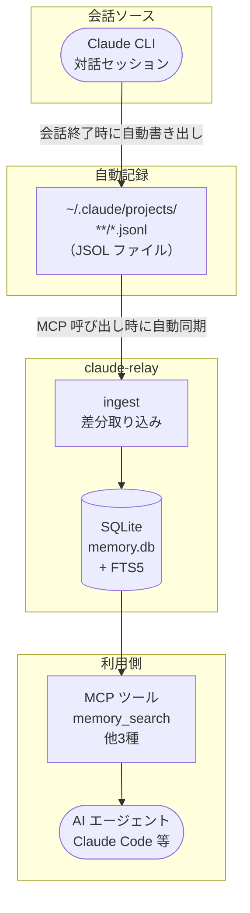
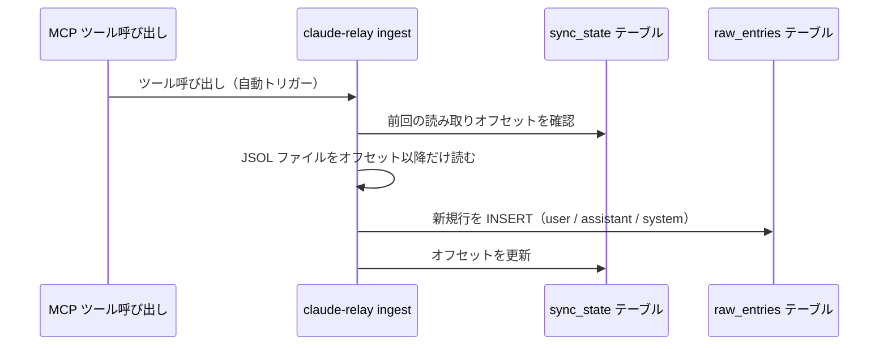

# claude-relay アーキテクチャ概要

## 何をするツールか

Claude CLI でのすべての会話は、自動的に `~/.claude/projects/` 配下の `.jsonl` ファイルに記録される。

**claude-relay** はこのファイルを SQLite に取り込み、AI エージェントが MCP ツール経由で過去の会話を検索・参照できるようにするメモリ拡張ツール。

### 解決する問題

Claude Code などの AI エージェントはセッションをまたいで記憶を持たない。  
claude-relay を導入すると、エージェントが自ら `memory_search` を呼び出して **「あの時こう話した」** を参照できるようになる。

- ローカル LLM 不要
- API 追加コスト不要
- Rust 製シングルバイナリ、デーモン不要

---

## パイプライン全体像



---

## コンポーネント

| コンポーネント | 役割 | 技術 |
|---|---|---|
| **ingest** | JSOL → SQLite への差分取り込み | Rust |
| **SQLite + FTS5** | 全文検索可能な会話データ保管庫 | rusqlite |
| **MCP サーバー** | `memory_search` 等のツールを stdio 経由で提供 | Rust |
| **CLI** | DB 管理・手動 ingest・デバッグ用 | clap |

---

## 差分取り込みの仕組み



- **冪等性あり**: 同じ行を 2 回 ingest しても重複しない
- **画像データ除外**: base64 エンコードされたバイナリは保存しない
- **壊れた JSON 行は自動スキップ**: パイプライン全体を止めない

---

## データベーススキーマ

```sql
-- 会話エントリ（生データ）
CREATE TABLE raw_entries (
  id         INTEGER PRIMARY KEY,
  session_id TEXT NOT NULL,     -- JSOL ファイル名 (UUID)
  timestamp  TEXT NOT NULL,     -- ISO 8601
  date       TEXT NOT NULL,     -- YYYY-MM-DD
  time       TEXT NOT NULL,     -- HH:MM:SS
  type       TEXT NOT NULL,     -- user / assistant / system
  tool_name  TEXT,              -- Bash, Read, Edit 等
  content    TEXT NOT NULL,     -- メッセージ本文
  cwd        TEXT,
  git_branch TEXT,
  created_at TEXT DEFAULT (datetime('now'))
);

-- 全文検索用 (FTS5)
CREATE VIRTUAL TABLE raw_entries_fts USING fts5(
  content, tool_name, session_id
);

-- 差分取り込み管理
CREATE TABLE sync_state (
  file_path   TEXT PRIMARY KEY,
  last_offset INTEGER DEFAULT 0
);
```

---

## MCP ツール一覧

| ツール名 | 説明 |
|---|---|
| `memory_search` | キーワード・日付でセッション横断検索 |
| `memory_get_entry` | 特定エントリの全文を取得 |
| `memory_list_sessions` | セッション一覧を取得 |
| `memory_get_session` | 特定セッションの会話フローを取得 |

---

## セットアップ

```bash
# ビルド
cargo build --release

# MCP サーバーとして登録（Claude Code の設定に追加）
# コマンド: /path/to/claude-relay mcp
# 通信方式: stdio

# 手動 ingest（動作確認用）
./target/release/claude-relay ingest ~/.claude/projects/

# 検索テスト
./target/release/claude-relay tool memory_search --query "キーワード"
```

---

## 設計上の判断

### summaries テーブルを廃止した理由

AI による情報圧縮（Claude Sonnet 級なら **1/20 に圧縮しても意味を保持できる**ことを実測で確認）はコンテキストウィンドウ節約として有効な技術だが、以下の理由から採用しなかった。

- **クラウド AI で生成**: ツール呼び出しのたびに API 料金が発生する
- **ローカル LLM で生成**: 十分な品質が出るモデルは大規模で、一般的なハードウェアでは非現実的

「使える人が限られる機能」をコアに組み込む判断はできなかった。

なお、本当の最高性能を求めるなら自動圧縮よりも `CLAUDE.md` / `MEMORY.md` に必要最小限の情報を自分でキュレーションして渡す方が良い結果が得られる。公式がこの機能を提供しない理由もそこにあると考えている。

DB は **生データの高速検索エンジン** としての役割に専念する。
