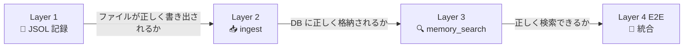
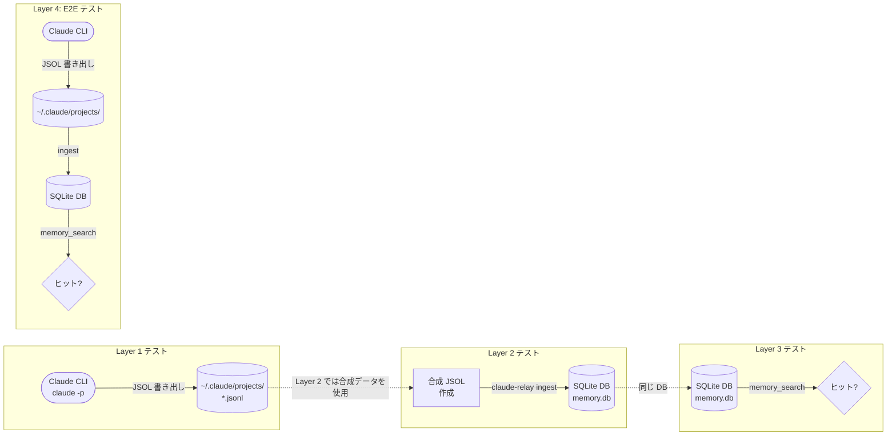
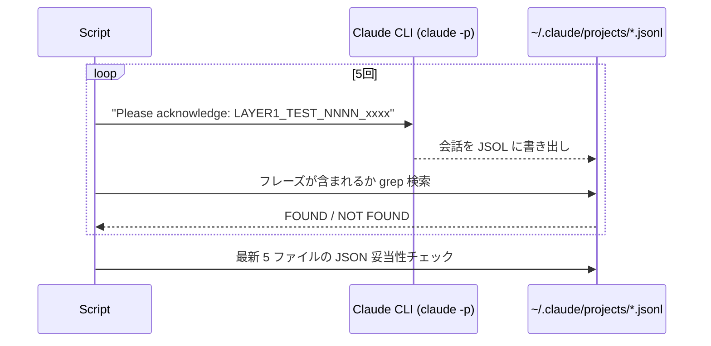
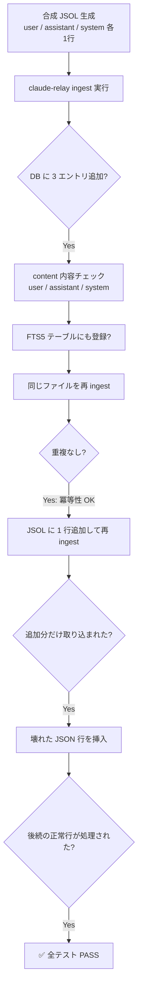
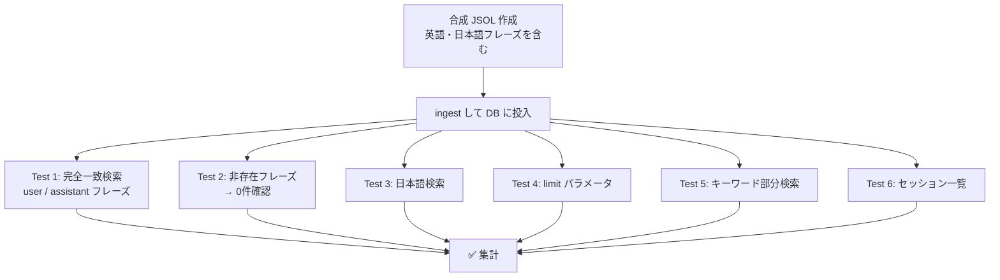
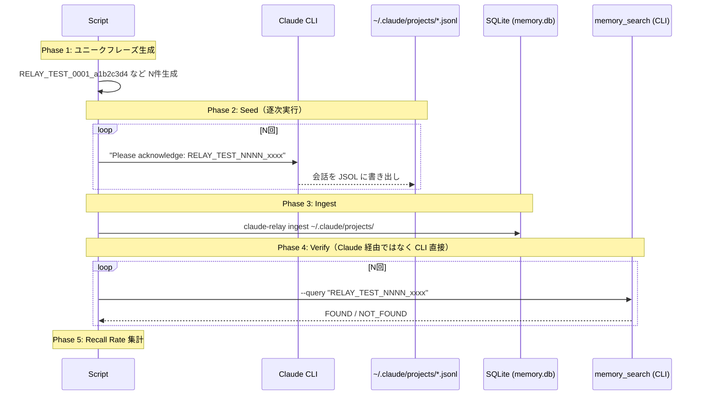

# claude-relay テスト設計書・結果レポート

**最終更新:** 2026-03-29

---

## テスト戦略

 claude-relay のコアパイプラインは「Claude CLI が会話を記録 → ingest で DB 取り込み → memory_search で検索」の 3 ステップで成り立つ。このパイプラインをそのまま E2E テストするだけでは、**どこで壊れたかわからない**。

そのため、**パイプラインを 4 つのレイヤーに分解し、それぞれを独立してテスト**している。



### 各レイヤーが保証すること

| Layer | テスト対象 | 合格が意味すること |
|---|---|---|
| **Layer 1** | Claude CLI → JSOL 書き出し | 会話内容がファイルに欠落なく記録されることを保証 |
| **Layer 2** | JSOL → ingest → SQLite | パーサーと DB 書き込みロジックの正確性・堅牢性を保証（差分取り込み・壊れた行のスキップ含む） |
| **Layer 3** | SQLite → memory_search | FTS5 全文検索が日本語を含む任意のフレーズを正確にヒットさせることを保証 |
| **Layer 4** | パイプライン全体 E2E | 上記 3 レイヤーが実環境で連携し、統計的に 100% の想起率を達成することを保証 |

### この設計の利点

- **故障箇所の特定が容易** — Layer 2 が落ちれば ingest のバグ、Layer 3 が落ちれば検索のバグ、と絞り込める
- **高速フィードバック** — Layer 2・3 は合成データを使うため API 不要・数秒で完了
- **E2E の信頼性** — Layer 4 で 30 フレーズを統計的に検証するため、「たまたまパスした」を排除できる

---

## 用語解説

| 用語 | 意味 |
|---|---|
| **JSOL** | JSON Lines 形式（`.jsonl`）のファイル。Claude CLI が会話終了時に `~/.claude/projects/` 配下に自動生成する |
| **ingest** | JSOL ファイルを解析して SQLite DB に取り込むコマンド。差分のみ取り込む（冪等性あり） |
| **FTS5** | SQLite の全文検索エクステンション。`memory_search` の検索バックエンド |
| **memory_search** | MCP ツール。キーワードで過去会話を検索して返す |
| **raw_entries** | 取り込まれた会話エントリを格納するメインテーブル |
| **sync_state** | 差分 ingest のためにファイルオフセットを記録するテーブル |

---

## テスト全体のアーキテクチャ



> **補足:** Layer 2・3 は合成データを使うため Claude API 不要・高速。Layer 1・4 は実際に `claude -p` を起動するため API キーが必要。

---

## セットアップ・前提条件

### 必要なもの

| ツール | 確認コマンド | 入手先 |
|---|---|---|
| Rust (cargo) | `cargo --version` | https://rustup.rs |
| claude CLI | `claude --version` | `npm install -g @anthropic-ai/claude-cli` |
| sqlite3 | `sqlite3 --version` | macOS 標準搭載 |
| openssl | `openssl version` | macOS 標準搭載 |
| tmux (Layer 4 interactive のみ) | `tmux -V` | `brew install tmux` |

### ビルド

```bash
cd /Volumes/2TB_USB/dev/claude-relay
cargo build --release
# → target/release/claude-relay が生成される
```

### クイックスタート（全テスト実行）

```bash
cd /Volumes/2TB_USB/dev/claude-relay

# Layer 2・3（合成データ・高速・API不要）
bash tests/test_layer2_ingest.sh   # ~5秒
bash tests/test_layer3_search.sh   # ~5秒

# Layer 1（Claude CLIが必要・~30秒）
bash tests/test_layer1_jsol.sh

# Layer 4 E2E（Claude CLIが必要・~4分）
bash tests/memory_recall_test.sh oneshot 30
```

---

## Layer 1: Claude 会話 → JSOL 記録

### スクリプト

```bash
bash tests/test_layer1_jsol.sh
```

### テストフロー



### テスト項目

| # | テスト | 内容 |
|---|---|---|
| 1-5 | JSOL 記録確認 | ユニークフレーズを `claude -p` で送信後、JSOL ファイルにフレーズが含まれるか |
| 6 | JSON 妥当性 | JSOL の各行が有効な JSON であるか |

### 何が確認できるか / できないか

✅ Claude CLI がセッション終了時に JSOL を正しく書き出すこと  
✅ フレーズが欠落なく記録されること  
❌ MCP 接続時の JSOL 構造の違い（ワンショットでは MCP 接続されない）  
❌ 長時間セッションでの書き込み整合性  

### 結果 (2026-03-29)

| 項目 | 値 |
|---|---|
| テスト数 | 5 |
| PASS | 5 |
| FAIL | 0 |
| **Verdict** | **PASS** |

---

## Layer 2: JSOL → ingest → DB

### スクリプト

```bash
bash tests/test_layer2_ingest.sh
```

### テストフロー



### テスト項目

| # | テスト | 内容 |
|---|---|---|
| 1 | 基本 ingest | 合成 JSOL 3行 → DB に 3 エントリ追加 |
| 2 | user content | user タイプのエントリ content がフレーズを含む |
| 3 | assistant content | assistant タイプのエントリ content がフレーズを含む |
| 4 | FTS5 登録 | FTS5 全文検索テーブルにも content が登録される |
| 5 | 冪等性 (idempotent) | 同じファイルを再 ingest しても重複エントリが作られない |
| 6 | 追記 ingest | JSOL に行を追加して再 ingest → 追加分だけ取り込まれる |
| 7 | 追記 FTS5 | 追記エントリも FTS5 に登録される |
| 8 | 壊れた JSON | 不正 JSON 行がスキップされ、後続の正常行が処理される |
| 9-11 | エントリタイプ | user / assistant / system が正しく格納される |

> **注意:** テストは本番 DB (`~/.claude-relay/memory.db`) を使用するが、ユニークプレフィックス付き session_id を使うため本番データとは干渉しない。

### 何が確認できるか / できないか

✅ JSOL パーサーが各エントリタイプを正しく処理すること  
✅ 差分 ingest（sync_state によるオフセット管理）が正常に動作すること  
✅ 壊れた JSON 行がパイプライン全体を止めないこと  
✅ FTS5 テーブルとの同期が保たれること  
❌ 実際の Claude CLI が生成する複雑な JSOL 構造（streaming, tool_use 等）  
❌ 大量ファイル（数千 JSOL）時のパフォーマンス  

### 結果 (2026-03-29)

| 項目 | 値 |
|---|---|
| テスト数 | 11 |
| PASS | 11 |
| FAIL | 0 |
| **Verdict** | **PASS** |

---

## Layer 3: DB → memory_search → ヒット

### スクリプト

```bash
bash tests/test_layer3_search.sh
```

### テストフロー



### テスト項目

| # | テスト | 内容 |
|---|---|---|
| 1 | 完全一致 (user) | user エントリのユニークフレーズを検索 → FOUND |
| 2 | 完全一致 (assistant) | assistant エントリのユニークフレーズを検索 → FOUND |
| 3 | 非存在フレーズ | 存在しないフレーズを検索 → 0 件 |
| 4 | 日本語検索 | 日本語を含むフレーズを検索 → FOUND |
| 5 | limit パラメータ | `--limit 1` で結果が返る |
| 6 | キーワード検索 | content 内のキーワードで検索 → 関連エントリがヒット |
| 7 | セッション一覧 | `memory_list_sessions` でテストセッションが表示される |

### 何が確認できるか / できないか

✅ FTS5 全文検索が正しく動作すること  
✅ 日本語コンテンツの検索（ICU tokenizer 不要でも動作すること）  
✅ limit パラメータによる結果制限  
✅ セッション管理が正常なこと  
❌ MCP JSON-RPC 経由での呼び出し（CLI 直接テスト）  
❌ AI が生成するクエリの品質  

### 結果 (2026-03-29)

| 項目 | 値 |
|---|---|
| テスト数 | 7 |
| PASS | 7 |
| FAIL | 0 |
| **Verdict** | **PASS** |

---

## Layer 4 (E2E): Claude に話す → 後で想起できる

### スクリプト

```bash
bash tests/memory_recall_test.sh oneshot 30        # ワンショットモード
bash tests/memory_recall_test.sh interactive 10    # インタラクティブモード（tmux 必要）
```

### E2E パイプラインフロー



### ユニークフレーズの設計

```
RELAY_TEST_0001_a1b2c3d4
RELAY_TEST_0002_e5f6a7b8
         ↑        ↑
  連番 4桁   ランダム hex 4バイト
```

→ 通常会話には絶対出てこないため false positive が起こり得ない。FOUND / NOT_FOUND の二値判定で recall rate を計算。

### テストモード比較

| 項目 | ワンショット (`claude -p`) | インタラクティブ (tmux) |
|---|---|---|
| 速度 | 1件 5-10秒 | 1件 35-40秒 |
| 30件の所要時間 | 約 3-5 分 | 約 15-20 分 |
| 実利用との近さ | 低い（MCP接続なし） | 高い（フルセッション） |
| CI 適性 | ✅ 高い | ❌ 低い |

### 統計的妥当性

| フレーズ数 | 意味 |
|---|---|
| 30 | 中心極限定理の最低ライン。平均・分散が意味を持つ |
| 50 | 95% 信頼区間で ±14% の精度 |

### 何が確認できるか / できないか

✅ JSOL 記録の信頼性（Claude CLI が正しく JSOL を書き出すこと）  
✅ ingest の正常動作（JSOL パーサーが SQLite に格納すること）  
✅ FTS5 全文検索の動作（memory_search がフレーズをヒットさせること）  
✅ パイプライン全体の整合性（上記すべてが連携して 100% recall を達成すること）  
❌ AI の memory_search ツール呼び出し精度（verify は CLI 直接検索）  
❌ MCP JSON-RPC プロトコルの通信（別途 MCP テストで対応）  
❌ 大量データ時のパフォーマンス（30件は機能テスト目的）  

### 結果 (2026-03-29)

| 項目 | 値 |
|---|---|
| モード | oneshot |
| フレーズ数 | 30 |
| Seed OK | 30 |
| Seed FAIL | 0 |
| Found | 30 |
| Not Found | 0 |
| Recall Rate | **100.0%** |
| 所要時間 | 約 4 分 (14:22 - 14:26) |
| **Verdict** | **PASS — 100% recall** |

---

## 全体サマリー (2026-03-29)

| Layer | テスト | 結果 | Verdict |
|---|---|---|---|
| 1: Claude → JSOL | 5/5 | 100% | **PASS** |
| 2: JSOL → ingest → DB | 11/11 | 100% | **PASS** |
| 3: DB → memory_search | 7/7 | 100% | **PASS** |
| 4: E2E (oneshot 30件) | 30/30 | 100% recall | **PASS** |

**全レイヤー PASS。パイプライン全体が正常に動作している。**

---

## トラブルシュート

| 症状 | 原因 | 対処 |
|---|---|---|
| `ERROR: claude CLI が動作しません` | node が PATH にない | `export PATH="/opt/homebrew/opt/node@20/bin:$PATH"` |
| `ERROR: target/release/claude-relay が見つかりません` | ビルド未完 | `cargo build --release` |
| Layer 1 で全件 FAIL | JSOL ディレクトリが空 | `~/.claude/projects/` が存在するか確認 |
| Layer 4 で recall rate が低い | API rate limit | フレーズ数を減らす / 逐次実行間隔を増やす |
| JSON 妥当性 WARN | Claude CLI の出力形式変更 | JSOL ファイルを手動確認 |

---

## ファイル構成

```
tests/
  test_layer1_jsol.sh        # Layer 1: Claude → JSOL 記録テスト
  test_layer2_ingest.sh      # Layer 2: JSOL → ingest → DB テスト
  test_layer3_search.sh      # Layer 3: DB → memory_search テスト
  memory_recall_test.sh      # Layer 4: E2E リコールテスト（oneshot / interactive）
  TEST_REPORT.md             # 本ドキュメント
  seed_worker.sh             # ⚠️ 旧版: tmux 並列ワーカー（廃止・参考保存）
  memory_recall_test_v2.sh   # ⚠️ 旧版: シンプルな E2E スクリプト（廃止・参考保存）
```

### 旧版ファイルについて

`seed_worker.sh` と `memory_recall_test_v2.sh` は現行の `memory_recall_test.sh` に置き換えられた旧実装。削除せず参考として保存。詳細は下記「旧版からの改善点」を参照。

---

## 旧版からの改善点

| 旧版の問題 | 新版の対応 |
|---|---|
| 1000フレーズ × 100並列 tmux pane | 30フレーズ × 逐次実行 |
| Claude CLI の並列起動による hook 競合 | 並列廃止 |
| JSOL 書き込み競合 | 1セッションずつ順番に実行 |
| API rate limit | 逐次実行で自然に回避 |
| pane_file 初期化漏れ | 毎回フレッシュなディレクトリ使用 |
| verify で Claude 経由（トークン浪費） | `claude-relay tool` で直接検索 |
| E2E テストのみ | 4レイヤー独立テスト + E2E |
